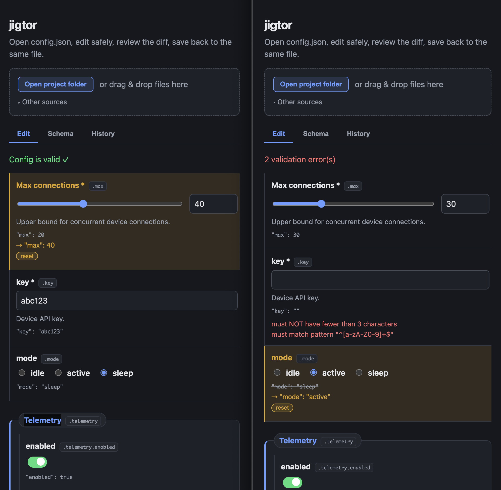

# jigtor

Local-first, **schema-driven `config.json` editor**. Open a project folder, edit
`config.json` through generated form controls with live validation, and save
back to the same file. No backend, no data leaves the browser.

Built for configuring devices across varied IoT environments — lightweight and
easy to run in restricted environments.

**Practical usage flow:** [`docs/USAGE.md`](./docs/USAGE.md) · 日本語 [`docs/USAGE.ja.md`](./docs/USAGE.ja.md)



## Use

Two editions, same editor — pick by environment:

- **Hosted web app** — open <https://elzup.github.io/jigtor/> in a Chromium-based
  browser (Chrome / Edge). In-place saving uses the File System Access API.
- **Offline desktop app** — download the macOS / Windows / Linux build from
  [Releases](https://github.com/elzup/jigtor/releases). Runs fully offline with
  native file access (no browser, no internet), so save-in-place works on any OS.
  It wraps the same web bundle in the OS webview (~9 MB — no bundled browser).

Choose **Open project folder**; if the folder holds several JSON files, pick which
to edit. Edit through generated controls, review the diff, and save back to the
same file. Schema and version history are written alongside the project under
`.jigtor/`; loaded files and edits stay local.

See [`docs/USAGE.md`](./docs/USAGE.md) for the full flow.

## Features (V1)

- Open a project folder and save edits back to `config.json`.
- Load `schema.json` / `config.schema.json` when present, or infer a schema from config.
- Form controls generated from a practical JSON Schema subset.
- Live validation (via [ajv](https://ajv.js.org/)) with errors shown beside each field.
- Save the edited `config.json` in place (download fallback for unsupported browsers).

### Supported JSON Schema subset

`type` (`object` / `string` / `number` / `integer` / `boolean` / `array`),
`properties`, `required`, `default`, `description`, `title`, `enum`,
`minimum` / `maximum`, `minLength` / `maxLength` / `pattern`, and simple `items`.

Unsupported keywords (`$ref`, `oneOf` / `anyOf` / `allOf`, conditionals, remote
schemas) are handled gracefully: such fields render as read-only placeholders and
validation ignores the reference rather than failing the whole config.

## Develop

```bash
ni            # install
nr dev        # dev server (jigtor.localhost via portless)
nr test       # vitest (unit + property-based + integration)
nr typecheck  # tsc --noEmit
nr build      # production build (single self-contained index.html)
```

Try it with the files in `examples/`.

### Desktop app ([Tauri](https://tauri.app/))

The desktop build reuses the same frontend; `src/tauri-fs.ts` backs the File
System Access seam with native Rust fs (`src-tauri/`) when running in the webview,
and is inert in a browser. Requires the [Rust toolchain](https://rustup.rs/).

```bash
nr tauri dev    # run the native app against the dev server
nr tauri build  # produce a native bundle (.app/.dmg, .msi, AppImage/deb)
```

Release: pushing a `v*` tag builds web + desktop and attaches everything to a
GitHub Release (`.github/workflows/release.yml`).

## Architecture

All schema parsing, validation, and rendering is pure, UI-neutral TypeScript in
`src/core/` (`parseSchema` → `validateConfig` → `renderForm`), driven by a thin
DOM shell in `src/main.ts`. See `src/core/types.ts` for the normalized field model.

## Quality: VCSDD

This project was built with **VCSDD** (Verified + Coherence Spec-Driven
Development): EARS specs → tests-first → implementation → adversarial review →
property-based hardening → convergence. The full trace, spec dependency graph
(`tools/ceg.mjs`), and 4 rounds of adversarial review live in
`.vsdd/config-editor/`. See `.vsdd/config-editor/CONVERGENCE.md`.

## Roadmap

- `$ref` resolution and `oneOf`/`anyOf`/`allOf`.
- Editable array UI (V1 is read-only for arrays).
- Signed / notarized desktop builds (current [Tauri](https://tauri.app/) builds
  are unsigned).
