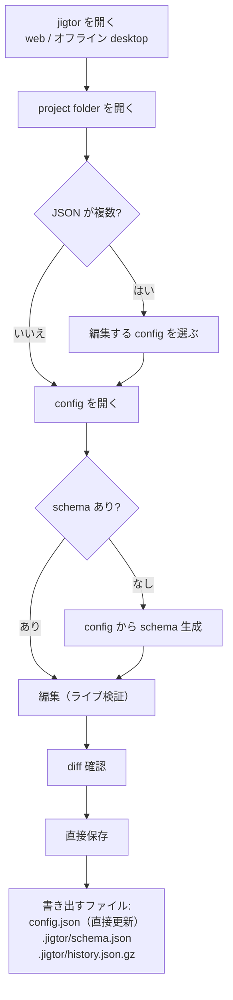

# jigtor — 実用フロー

ローカル完結・スキーマ駆動の `config.json` エディタ。実際の使い方を通しで説明します。

> English: [`USAGE.md`](./USAGE.md)

## エディション

jigtor は**まったく同じエディタ**を2つの形で配布します。環境で選んでください:

| | ホスト web 版 | オフライン デスクトップ版 |
|---|---|---|
| 入手 | `https://elzup.github.io/jigtor/` | [GitHub Releases](https://github.com/elzup/jigtor/releases) から DL(macOS / Windows / Linux) |
| 動作 | Chromium 系ブラウザ(Chrome / Edge) | ネイティブアプリ — ブラウザ不要・ネット不要 |
| 直接保存 | File System Access API(Chromium のみ) | ネイティブ file access(全 OS で動く) |
| 向く用途 | すぐ編集・常に最新 | 制限/エアギャップ環境、非 Chromium マシン |

デスクトップ版は同じ web バンドルをネイティブウィンドウに包んだもの(約 9 MB —
OS の webview を使うので**ブラウザは同梱しません**)。読み書きはブラウザ API では
なく OS 経由なので、「直接保存」が全 OS で完全オフラインに動きます。

## 実装済みフロー



保存時に jigtor が作成/更新するファイル: **`config.json`**(あなたのファイル、直接更新)、
**`.jigtor/schema.json`**(現在の schema)、**`.jigtor/history.json.gz`**(gzip 圧縮の
バージョン履歴)。フォルダ内のそれ以外には一切触れません。

### 1. jigtor を開く

**ホスト web 版** — Chromium 系ブラウザ(Chrome / Edge)で
`https://elzup.github.io/jigtor/` を開く。アプリは配信されますが、`config.json`
の内容はサーバーへ送信しません。

**オフライン デスクトップ版** — [GitHub Releases](https://github.com/elzup/jigtor/releases)
から OS 別ビルドを DL して起動。ネットもブラウザも不要で、file access が
ネイティブなので macOS / Windows / Linux いずれでも直接保存が動きます。
(ビルドは未署名。macOS の初回は 右クリック → 開く が必要な場合あり)

どちらのエディションでも次の手順:

1. **Open project folder** を押す
2. 対象の config があるディレクトリを選ぶ
3. (web 版のみ)ブラウザの権限確認で許可する
4. フォルダに JSON が複数あれば、**どのファイルを編集するか**尋ねます
   (`config.json` があれば強調表示)。1 つだけなら直接開きます。

**Project files** ツリーで、そのフォルダ内で jigtor が扱うもの — 編集中の config、
兄弟 JSON(クリックで切替)、`.jigtor/` の生成物 — が見えます。前回の
`.jigtor/schema.json` があれば自動読み込み。無ければ config から**スキーマ生成を
推奨**し、型付きコントロールを得られます。

#### ディレクトリ構造の例

jigtor は**ホスト型の web アプリ**で、**フォルダに何かを設置(インストール)することは
ありません**。最初は編集対象の `config.json` だけで構いません。**Open project folder** が
それを読み、保存時に同じフォルダへ書き戻します。

**フォルダ — 保存前**

```text
my-device/
└── config.json
```

**編集後**、**Review & save…** から保存すると `config.json` が直接更新されます。
jigtor が書き出すもの(現在の schema と、全保存バージョンの gzip ログ)はすべて
`.jigtor/` にまとめて置かれます。

```text
my-device/
├── config.json              ← 直接更新される(あなたのファイル、root 直下)
└── .jigtor/                 ← jigtor が書き出すものはすべてここ
    ├── schema.json          ← 現在の schema(読み書きとも同じパス)
    └── history.json.gz      ← gzip 圧縮したバージョン履歴(最新 200 版)
```

### 2. ファイルを読み込む

通常は **Open project folder** でディレクトリを選ぶ。**JSON Schema** は任意です。

- schema が無い場合: config だけ読み込んで **Generate schema from config** を押すと、
  型を推論した下書きスキーマを生成(往復安全)。
- File System Access API 非対応ブラウザ(Safari / Firefox)では直接上書き保存はできず
  download fallback になります。そうしたマシンで直接保存したいときは**デスクトップ版**を使ってください。
- **Load example** でデモ(schema + config)を即起動して試せる。

### 3. 生成されたコントロールで編集

スキーマからフォームが生成され、型に応じた widget が出ます:

| スキーマの形 | widget |
|---|---|
| `string`(通常) | テキスト入力 |
| `string` 長文(`maxLength >= 80`) | textarea |
| `string` + `enum`(6 個以下) | ラジオボタン |
| `string` + `enum`(7 個以上) | セレクト |
| `number` / `integer` で `minimum` と `maximum` **両方**あり | スライダー + 数値入力 |
| `number` / `integer` それ以外 | 数値入力 |
| `boolean` | トグル |
| `object` | ネストした fieldset |
| `array`(primitive 要素) | 要素ごとの入力行(追加 / 削除 / 並べ替え) |
| `array`(object 要素) | 要素ごとの折りたたみサブフォーム |

- **ライブ検証**(ajv): 入力中に各フィールド脇へエラー表示。操作中の入力要素は
  作り直さないので、スライダーのドラッグやテキストのカーソルが自然なまま。
- **ドット記法パス**(`.server.port`)を全フィールドに表示。config のどこを
  編集しているか常に分かる。
- **未保存の変更を促す**: Save ボタンに `Review & save… (N)`(保留件数)を表示し、
  フッターに「まだ保存していない」旨の注意、未保存のままタブを閉じるとブラウザの
  確認ダイアログが出る。

### 4. スキーマを調整(Schema タブ)

スキーマをフラットな `.dir.field` 行として編集 — キー / 型 / default / validation
(`min`/`max`、`minLen`/`maxLen`/`pattern`、`enum`、`required`)。現在のスキーマから
生成される有効な config の **sample JSON プレビュー**を常時表示。生スキーマ JSON は
トグルの奥に残してあります。

### 5. 確認して保存

**Review & save…** で保存前に **diff**(読み込み時の baseline と現在)と有効性を
表示。保存は `config.json`(2 スペース字下げ)へ直接書き戻します。**無効な状態でも
保存可能** — 作業を保存できずに詰まることはありません。

### 6. セッション継続

直近の schema + config を `localStorage` に保存し、次回自動復元。フォルダ権限がある場合は
全バージョン履歴を `.jigtor/history.json.gz`(gzip 圧縮、最新 200 版)にも残します。
自動復元後は保存先が未接続のため、ファイル操作欄に alert を表示して Edit パネルを
一時的に無効化します。**Reconnect project folder…** では、ファイルの整合性を保つため
元と同じフォルダを選択してください。**Save** までは書き込みません。
直接保存を使わない場合は **Use Download mode** で編集を続行できます。
**Forget saved** でブラウザ内の復元情報を消去。

## 対応する JSON Schema サブセット(V1)

`type`(`object` / `string` / `number` / `integer` / `boolean` / `array`)、
`properties`、`required`、`default`、`description`、`title`、`enum`、
`minimum` / `maximum`、`minLength` / `maxLength` / `pattern`、単純な `items`。

未対応(`$ref`、`oneOf` / `anyOf` / `allOf`、条件付き、リモートスキーマ)は
グレースフルに劣化: 該当フィールドは読み取り専用プレースホルダで描画し、検証は
その参照を無視して config 全体を落とさない。

## アーキテクチャ(コントリビュータ向け)

`src/core/` に純粋・UI 非依存の TypeScript(`parseSchema` → `validateConfig` →
`renderForm`、加えて `inferSchema` / `applyDefaults` / `diffConfig` / `schemaEdit`)、
`src/main.ts` は薄い DOM シェル。VCSDD で構築し、スキーマ依存グラフと敵対的レビューの
軌跡は `.vsdd/config-editor/` にあります。
