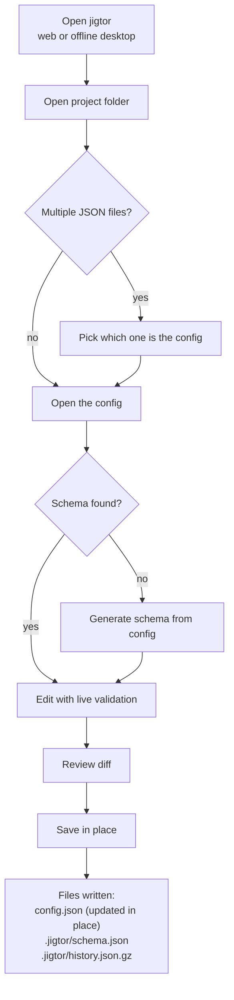

# jigtor — Practical Usage Flow

Local-first, schema-driven `config.json` editor. This document describes how you
actually use it end to end.

> 日本語版: [`USAGE.ja.md`](./USAGE.ja.md)

## Editions

jigtor ships in two forms that share the exact same editor — pick by environment:

| | Hosted web app | Offline desktop app |
|---|---|---|
| Get it | `https://elzup.github.io/jigtor/` | Download from [GitHub Releases](https://github.com/elzup/jigtor/releases) (macOS / Windows / Linux) |
| Runs | Chromium-based browser (Chrome / Edge) | Native app — no browser, no internet needed |
| In-place save | File System Access API (Chromium only) | Native file access (works on any OS) |
| Best for | Quick edits, always-latest | Restricted / air-gapped environments, non-Chromium machines |

The desktop build wraps the same web bundle in a native window (~9 MB — it uses
the OS webview, it does **not** ship a browser). File reads and writes go through
the OS instead of the browser API, so the "save in place" flow works everywhere,
fully offline.

## As-built flow



Files jigtor creates or updates on save: **`config.json`** (your file, in place),
**`.jigtor/schema.json`** (current schema), and **`.jigtor/history.json.gz`**
(gzipped version history). Nothing else in the folder is touched.

### 1. Open jigtor

**Hosted web app** — open `https://elzup.github.io/jigtor/` in a Chromium-based
browser (Chrome / Edge). The app is served online, but your `config.json`
contents are never sent to the server.

**Offline desktop app** — download the build for your OS from
[GitHub Releases](https://github.com/elzup/jigtor/releases) and launch it. No
internet or browser required; file access is native, so in-place saving works on
macOS, Windows, and Linux alike. (Builds are unsigned — on first launch macOS
may need right-click → Open.)

Then, in either edition:

1. Click **Open project folder**.
2. Select the project directory that contains your config.
3. (Web only) grant the browser permission.
4. If the folder holds more than one JSON file, jigtor asks **which file to
   edit** (with `config.json` pre-highlighted). A single JSON is opened directly.

A **Project files** tree shows what jigtor manages in that folder — the config
you are editing, sibling JSON files (click to switch), and the `.jigtor/`
artifacts. If the folder already has a `.jigtor/schema.json` from a previous
session, jigtor loads it automatically; if not, it **recommends generating a
schema** from your config to get typed controls.

#### Directory layout example

jigtor is a hosted web app — **nothing is installed into your folder**. You only
need the target `config.json` to start; **Open project folder** reads it and, on
save, writes back to the same folder.

**Your folder — before**

```text
my-device/
└── config.json
```

**After editing**, **Review & save…** writes `config.json` back in place. All
jigtor artifacts are kept together under `.jigtor/`: the current schema and a
gzip-compressed log of every saved version.

```text
my-device/
├── config.json              ← updated in place (your file, at the root)
└── .jigtor/                 ← everything jigtor writes lives here
    ├── schema.json          ← current schema (read from / written to the same path)
    └── history.json.gz      ← gzipped versioned snapshots (latest 200)
```

### 2. Load your files

Normally, choose the directory via **Open project folder**. A **JSON Schema** file
is optional.

- No schema? Load the config alone and click **Generate schema from config** to
  get an editable draft schema (types inferred, round-trip safe).
- Browsers without File System Access API support (Safari / Firefox) fall back to
  downloading `config.json` instead of writing in place — use the **offline
  desktop app** to save in place on those machines.
- **Load example** boots a demo (schema + config) to try the tool immediately.

### 3. Edit through generated controls

The form is generated from the schema, with type-appropriate widgets:

| Schema shape | Widget |
|---|---|
| `string` (plain) | text input |
| `string` long (`maxLength >= 80`) | textarea |
| `string` + `enum` (≤ 6 options) | radio group |
| `string` + `enum` (> 6 options) | select |
| `number` / `integer` with **both** `minimum` and `maximum` | slider + number input |
| `number` / `integer` otherwise | number input |
| `boolean` | toggle |
| `object` | nested fieldset |
| `array` (primitive items) | per-item rows (add / remove / reorder) |
| `array` (object items) | a collapsible subform per item |

- **Live validation** (ajv): errors appear beside each field as you type; the
  input you are editing is never rebuilt, so slider drag / text caret stay smooth.
- **Dotted path** (`.server.port`) is shown on every field so you always know
  where in the config you are.
- **Unsaved-change prompt**: the Save button shows `Review & save… (N)` with the
  number of pending changes, a footer note reminds you they are not saved yet,
  and closing the tab with unsaved changes triggers a browser confirm.

### 4. Adjust the schema (Schema tab)

Edit the schema as flat `.dir.field` rows — key, type, default, and validation
(`min`/`max`, `minLen`/`maxLen`/`pattern`, `enum`, `required`). A live **sample
JSON preview** shows a valid config produced from the current schema. Raw schema
JSON stays available behind a toggle.

### 5. Review & save

**Review & save…** shows a **diff** (loaded baseline vs current) and the validity
state before saving. Save writes back to `config.json` (2-space indent). Saving
is allowed even when invalid — you are never blocked from preserving your work.

### 6. Session continuity

The last schema + config is persisted to `localStorage` and auto-restored on the
next visit. When folder permission is available, the full version history is also
written to `.jigtor/history.json.gz` (gzipped, latest 200 versions). **Forget
saved** clears the browser restore data.

## Supported JSON Schema subset (V1)

`type` (`object` / `string` / `number` / `integer` / `boolean` / `array`),
`properties`, `required`, `default`, `description`, `title`, `enum`,
`minimum` / `maximum`, `minLength` / `maxLength` / `pattern`, simple `items`.

Unsupported (`$ref`, `oneOf` / `anyOf` / `allOf`, conditionals, remote schemas)
degrade gracefully: such fields render as read-only placeholders and validation
ignores the reference instead of failing the whole config.

## Architecture (for contributors)

Pure, UI-neutral TypeScript in `src/core/` (`parseSchema` → `validateConfig` →
`renderForm`, plus `inferSchema` / `applyDefaults` / `diffConfig` / `schemaEdit`),
driven by a thin DOM shell in `src/main.ts`. Built with VCSDD; the full spec
graph and adversarial-review trace live in `.vsdd/config-editor/`.
